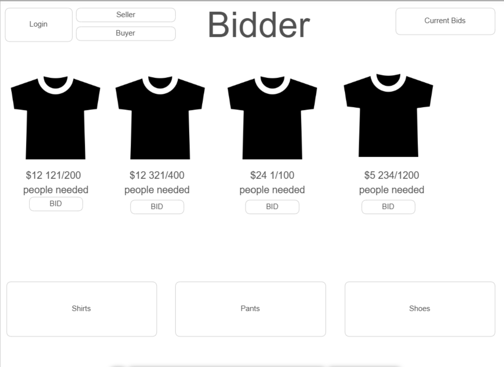
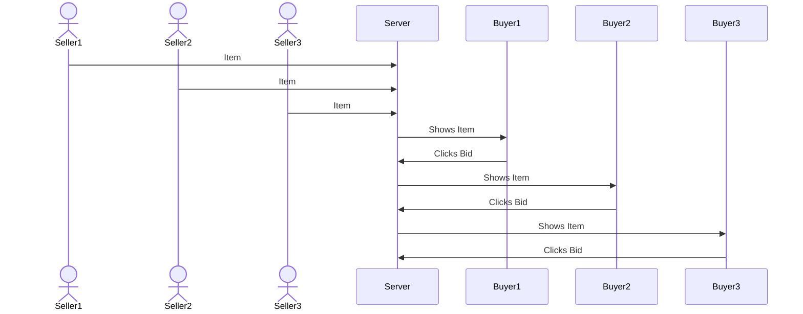

# Bidder

[My Notes](notes.md)

Website that allows sellers to list items that people may show intrest in by bidding and if enough bids go through the seller must create and ship the product out to the buyers. If not enough bids are placed then no one has to pay for anything.

## 🚀 Specification Deliverable
For this deliverable I did the following. I checked the box `[x]` and added a description for things I completed.

- [X] Proper use of Markdown
- [X] A concise and compelling elevator pitch
- [X] Description of key features
- [X] Description of how you will use each technology
- [X] One or more rough sketches of your application. Images must be embedded in this file using Markdown image references.

### Elevator pitch

Imagine a website that allows for a item to be put up by a seller needing a minumun quantity to be sold before producing. Now imagine clients who want to look for things to buy and also get discount, this website will fufill both sides of this allowing sellers to see what people want to buy, and buyers can purchase things they find cool.

### Design

Here is a sequence diagram that shows how to sellers and buyers would interact with the backend to list and buy items.

### Key features

- Ability to post items to sell/allow people to bid on
- Allow buyers to bid on items they like
- Show how many bids are on each item/how many are needed
- Price listed for every item
- Seperate accounts for buying and selling with secure logins

### Technologies

I am going to use the required technologies in the following ways.

- **HTML** - I will use correct HTML to structure my pages. I will have a seller page and a buyer page and pages for the listing items.
- **CSS** - Will make the website look nice and fun to use, good color scheme and a format that works on diffrent screens.
- **React** - Will allow users to login, listing display, display other users bids and use of React for routing and components.
- **Service** - Backend service for:
  - login
  - sending listings out
  - submitting bids
  - showing total bids
- **DB/Login** - Store users, bid data, listing data, Register and login users. Securely store users and only allow bidding on athenticated accounts.
- **WebSocket** - As each user bids, total bids are listed to all users. As sellers send out listings, new listings are populated for all users.

## 🚀 AWS deliverable

For this deliverable I did the following. I checked the box `[x]` and added a description for things I completed.

- [x] **Server deployed and accessible with custom domain name** - [My server link](https://quickbid.click).

## 🚀 HTML deliverable

For this deliverable I did the following. I checked the box `[x]` and added a description for things I completed.

 
- [X] **HTML pages** - I have six html pages that have pretty much everything I need for info and have html all over them
- [X] **Proper HTML element usage** - I used everything correctly and made sure the formating was good and is readable and understandable by me
- [X] **Links** - I added my github link on everypage and also source links that have my Bid images linked to more info and all pages are interconnected
- [X] **Text** - All listings have an amount of bids and cash cost and have a info page with text
- [X] **3rd party API placeholder** - On the Cart page the credit card info place is the API placeholder which gets bank info/credit/money api calls
- [X] **Images** - I added placeholder images for the seller listings/buyer bids.
- [X] **Login placeholder** - There is a login and it also redirects to a seller/buyer page
- [X] **DB data placeholder** - Input box and submit buttn for login, sellers can sumbit listings with info, listings are pulled from the database and displayed to the users.
- [X] **WebSocket placeholder** - The counting of current bids on each listing is done in realtime by the bid votes users place.

## 🚀 CSS deliverable

For this deliverable I did the following. I checked the box `[x]` and added a description for things I completed.

- [X] **Header, footer, and main content body** - I added css to make the Header footer and main body all look good
- [X] **Navigation elements** - I made the navigation look good and scale nicely with the flex to and go away as you scroll down.
- [X] **Responsive to window resizing** - I added flex so that my website is resizeable and usuable on multiple devices.
- [X] **Application elements** - Made buttons and other input nicer using css and attribures
- [X] **Application text content** - made the text look nicer gave a better font and used opposite colors, white on black and black on white for a consise and modern look.
- [X] **Application images** - placeholder images have been put in where sellers will put in the pictures to have bids placed.

## 🚀 React part 1: Routing deliverable

For this deliverable I did the following. I checked the box `[x]` and added a description for things I completed.

- [ ] **Bundled using Vite** - I did not complete this part of the deliverable.
- [ ] **Components** - I did not complete this part of the deliverable.
- [ ] **Router** - Routing between login and voting components.

## 🚀 React part 2: Reactivity

For this deliverable I did the following. I checked the box `[x]` and added a description for things I completed.

- [ ] **All functionality implemented or mocked out** - I did not complete this part of the deliverable.
- [ ] **Hooks** - I did not complete this part of the deliverable.

## 🚀 Service deliverable

For this deliverable I did the following. I checked the box `[x]` and added a description for things I completed.

- [ ] **Node.js/Express HTTP service** - I did not complete this part of the deliverable.
- [ ] **Static middleware for frontend** - I did not complete this part of the deliverable.
- [ ] **Calls to third party endpoints** - I did not complete this part of the deliverable.
- [ ] **Backend service endpoints** - I did not complete this part of the deliverable.
- [ ] **Frontend calls service endpoints** - I did not complete this part of the deliverable.

## 🚀 DB/Login deliverable

For this deliverable I did the following. I checked the box `[x]` and added a description for things I completed.

- [ ] **User registration** - I did not complete this part of the deliverable.
- [ ] **User login and logout** - I did not complete this part of the deliverable.
- [ ] **Stores data in MongoDB** - I did not complete this part of the deliverable.
- [ ] **Stores credentials in MongoDB** - I did not complete this part of the deliverable.
- [ ] **Restricts functionality based on authentication** - I did not complete this part of the deliverable.

## 🚀 WebSocket deliverable

For this deliverable I did the following. I checked the box `[x]` and added a description for things I completed.

- [ ] **Backend listens for WebSocket connection** - I did not complete this part of the deliverable.
- [ ] **Frontend makes WebSocket connection** - I did not complete this part of the deliverable.
- [ ] **Data sent over WebSocket connection** - I did not complete this part of the deliverable.
- [ ] **WebSocket data displayed** - I did not complete this part of the deliverable.
- [ ] **Application is fully functional** - I did not complete this part of the deliverable.
